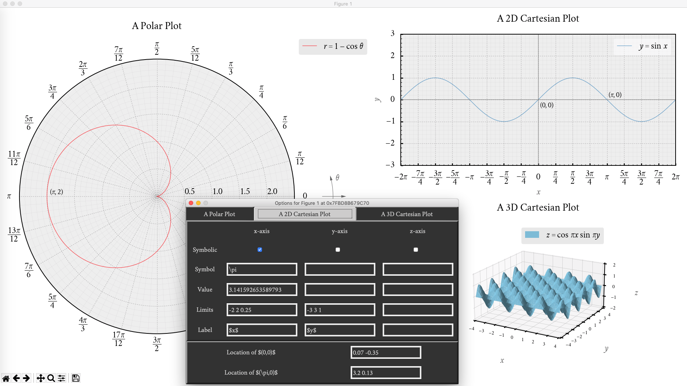
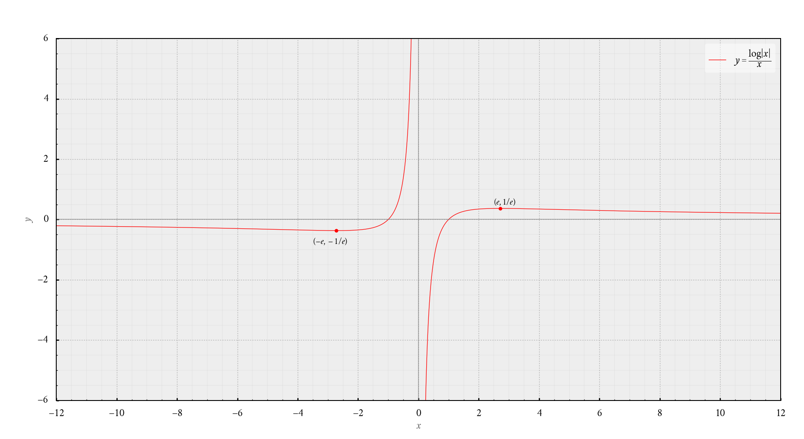
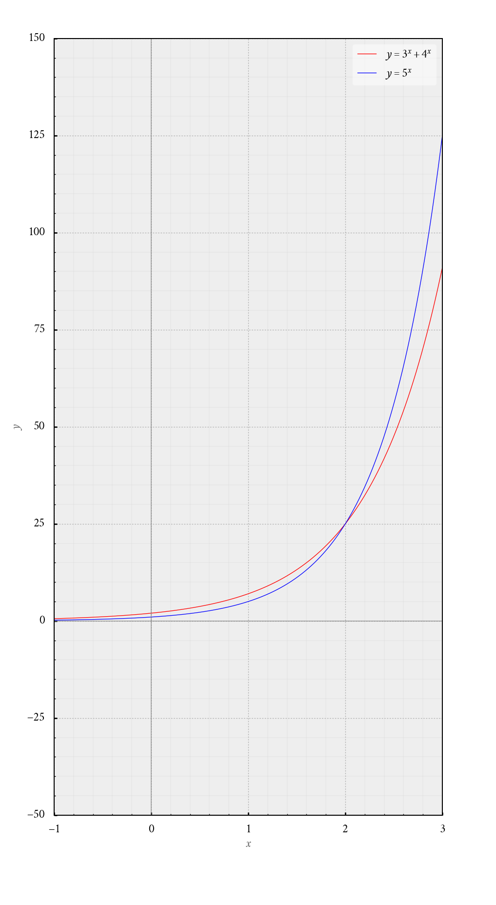
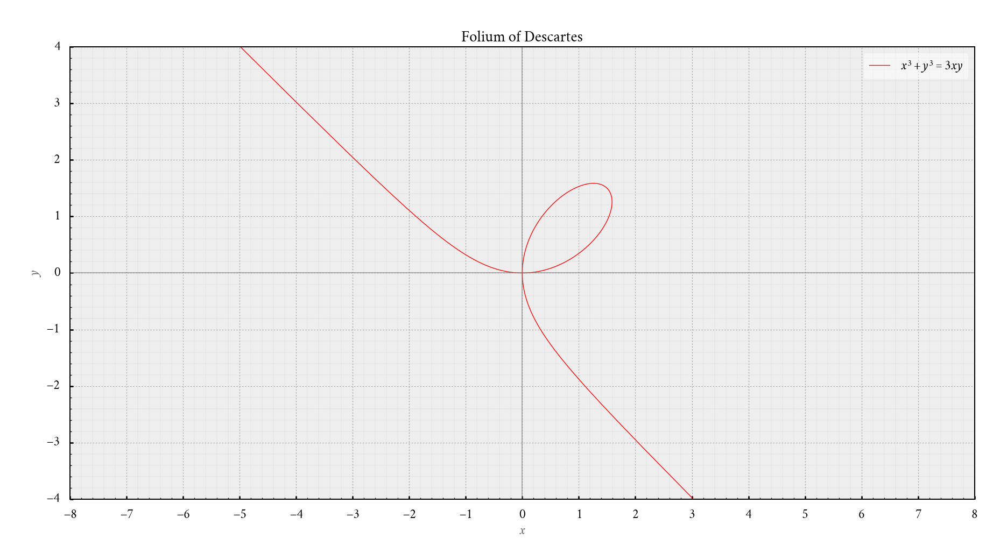
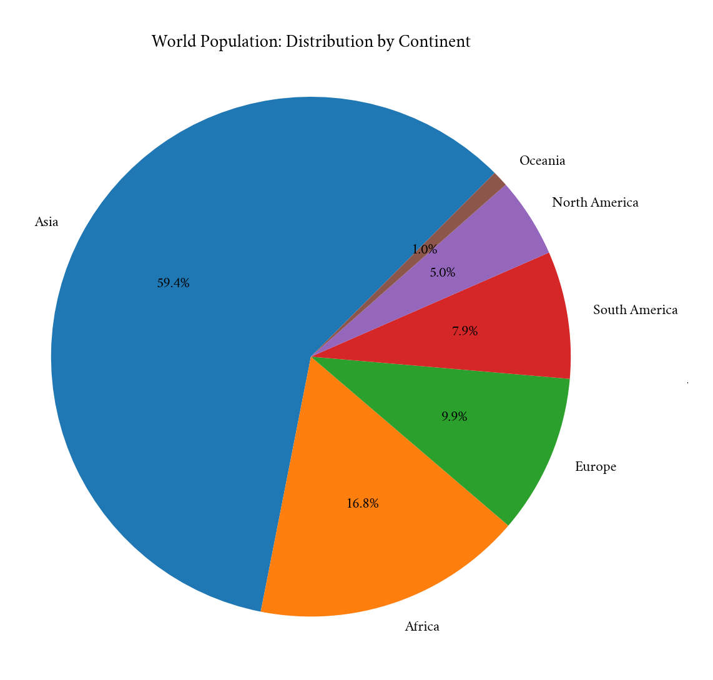
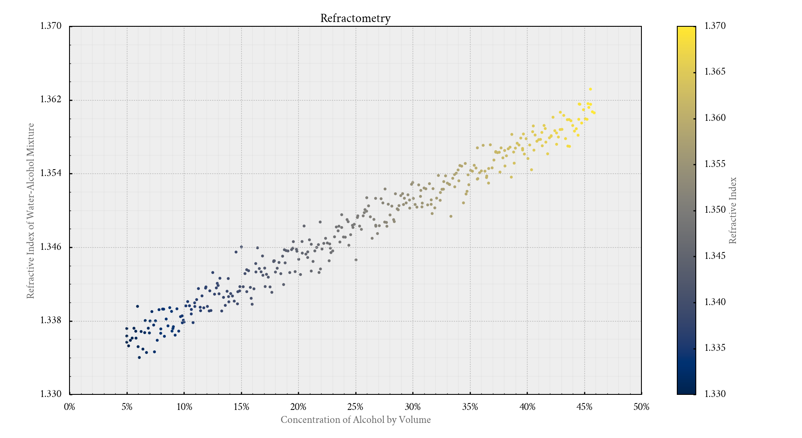

# Introduction
Customplot is a  wrapper around Matplotlib. It can be used to plot beautiful,
publication-quality graphs, which can optionally be controlled interactively.



I mainly wrote this to plot graphs of functions in the Cartesian plane, but it
can be used for many other things, too. (Take a gander at the
[gallery](#gallery).)

# Requirements
| Name       | Version  | Comment  |
| :--------: | :------: | :------: |
| Python     | 3.8      | Required |
| Matplotlib | 3.3.4    | Required |
| NumPy      | 1.17     | Required |
| curses     | 2.2      | Optional |

These requirements are not strict. Slightly older versions should also be okay.

# Usage
Call `limit` and `polish` on your Matplotlib axes instance before and after
plotting, respectively. Check the file `examples.py` for details. You can run
it using the command
```console
$ python3 examples.py
```
to see how things work.

A good way to start plotting your own graphs might be to copy parts of the code
in `examples.py` to another file, make modifications to that file, and run it.

# Notes

## General
Customplot cannot replace Matplotlib or Pyplot. It just does a few things which
make the plot look pretty (to my eyes, at least). For sufficiently complicated
plots, you may have to use functions of Matplotlib or Pyplot directly.

Only `rectilinear`, `polar` and `3d` projections of Matplotlib axes are
supported. Other projections can also be used, but their beautification may not
happen automatically.

## Interactive Plots
As seen in the image above, you can interactively adjust some plot elements of
all Matplotlib axes in a figure (provided that the curses module is installed
and available). To do so, just use `customplot.show(fig)` (`fig` being the
Matplotlib figure instance) instead of `plt.show()`. More details can be found
in `examples.py`.

**Matplotlib is not thread-safe!** Since the curses GUI is run in a separate
thread, you may occasionally have to trigger additional GUI events (e.g.
resizing the figure window) to have the desired effect.

## Fonts
Using a good font can significantly improve the appearance of your plot. (Check
out the [gallery](#gallery). The font used in those plots is
[Cochineal](https://ctan.org/pkg/cochineal).)

In case you want nothing to do with fonts, you can ignore this section
entirely.

### Using a Packaged Font
Some fonts are packaged with Matplotlib; you can choose one of them. My
suggestion is a STIX font. To use it, add the following lines to the file
`light.mplstyle` (you can find this file in the `styles` directory).
```python
font.family: STIXGeneral
mathtext.fontset: stix
```

Computer Modern is also available, but I do not recommend using it, because it
cannot render minus signs in normal text.

### Using a Custom Font
Let's say you want to use Libre Baskerville.
* Download and install Libre Baskerville. (It will probably be freely available
as a package containing multiple font files.) On most operating systems, you
can simply unzip the package and double-click on each of the font files to
install it.
* Find out where Matplotlib stores its cache.
```console
$ python3
>>> import matplotlib as mpl
>>> mpl.get_cachedir()
```
* Delete all font-related cache files in that location.
* Add the following lines to the file `light.mplstyle`.
```python
font.family: Libre Baskerville
mathtext.bf: Libre Baskerville:bold
mathtext.it: Libre Baskerville:italic
mathtext.rm: Libre Baskerville
mathtext.fontset: custom
mathtext.fallback: stix
mathtext.default: it
```

## Subplots
Sometimes, subplots (multiple plots in a single figure) don't look pretty
because elements from adjacent plots overlap with each other. To get around
this problem, you can interactively adjust the spacing by using the 'Configure
subplots' option in the navigation toolbar of the figure.

After doing this, un-maximise and maximise the figure window. As a result,
anything that needs to be redrawn will be redrawn.

## DPI Settings
If the plot doesn't look quite right, try playing around with the DPI parameter
before adjusting anything else. In the file `light.mplstyle`, search for
`figure.dpi` and change the value next to it.

In my experience, a value of 192 produces pretty graphs on a 1080p screen,
while a 768p screen may require setting it to 135 or so. On a 720p screen, 128
should work well.

## Essential and Jump Discontinuities
There are two types of discontinuities most graph plotters struggle with:
* essential discontinuities (like those in the graph of _y_ = tan _x_); and
* jump discontinuities (like those in the graph of _y_ = sgn _x_).

A vertical line is automatically drawn at each point of discontinuity. This is
simply a result of the plotting algorithm used by graph plotters. If this
happens in your plot, try using the `sanitise` function with a suitable value
of `maximum_diff`. (A demonstration can be found in `examples.py`.)

# Gallery
  
  
  
  
  
  
  
  
  


