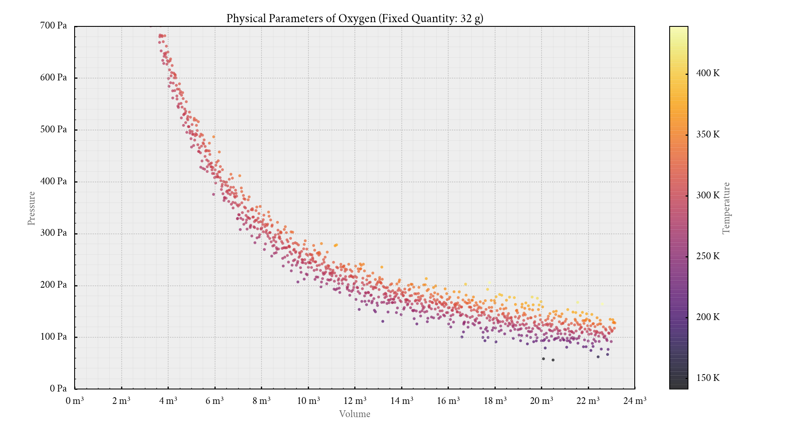

# CustomPlot
A wrapper around Matplotlib. It can be used to plot beautiful,
publication-quality graphs. I mainly wrote this to plot graphs of maths
functions. But with some extra effort, you can plot almost anything!

  
  
  
  


CustomPlot cannot replace Matplotlib or Pyplot. It just automates some settings
which make the plot look appealing. For sufficiently complicated plots, you may
have to use some functions of Matplotlib or Pyplot directly.

# Requirements
| Name       | Minimum Version |
| :--------: | :-------------: |
| Python     | 3.8             |
| Matplotlib | 3.3.4           |
| NumPy      | 1.17            |

These requirements are not strict. Slightly older versions should also be okay.

# Usage
Clone or download this repository. Open a terminal window to the clone or
download location. Several examples have been provided in `examples.py`;
hopefully, they will make everything clear. Run the script
```shell
python3 examples.py
```
and tinker with the code if you'd like to.

A good way to start plotting your own graphs might be to copy parts of the code
in `examples.py` and make modifications to the copy.

# Notes

## Fonts
Using a good custom font can significantly improve the appearance of your plot.
(Take a look at the [gallery](gallery/). The font used in those plots is
Cochineal.)

In case you want nothing to do with fonts, you can ignore this section
entirely. Matplotlib will warn you that Cochineal is not installed (if it
isn't), and fall back to the default font. (Functionality remains unaffected.)

### Using a Custom Font
Let's say you want to use Libre Baskerville.
* Download the font files for Libre Baskerville. (It is a Google font. So, it
will probably be freely available as a package containing four or more files
with the extension `.ttf`, or perhaps `.otf`).
* Create a new directory `~/.fonts/LibreBaskerville` and put the
above-mentioned font files in that directory.
* Find out where Matplotlib stores its cache.
```python
import matplotlib
print(matplotlib.get_cachedir())
```
* Delete all font-related cache files in that location.
* Open the file `dandy.mplstyle` and search for `Cochineal`. Replace it,
wherever it appears, with `Libre Baskerville`. In other words, the contents of
`dandy.mplstyle` should be something like this. (Only the relevant lines are
shown.)
```python
...
font.family: Libre Baskerville
...
mathtext.cal: Libre Baskerville:bold:italic
mathtext.rm : Libre Baskerville
mathtext.tt : Libre Baskerville
mathtext.it : Libre Baskerville:italic
mathtext.bf : Libre Baskerville:bold
mathtext.sf : Libre Baskerville
...
```

After this, any text in any new graph you plot will use Libre Baskerville. If
you feel confident, you can experiment with different fonts (i.e. a monospace
font for `mathtext.tt`, a calligraphy font for `mathtext.cal` and a sans-serif
font for `mathtext.sf`).

### Using a Built-in Font
You have a choice of fonts available out of the box. My suggestion is to use
the serif font. To do so, modify the file `dandy.mplstyle` like this. (Once
again, only the relevant lines are shown.)
```python
...
font.family: serif
...
mathtext.fontset: dejavuserif
...
```

## XKCD-style Plots
There is an example of an XKCD-style graph plot in `examples.py`. It looks best
when it uses the Humor Sans font, which can be installed via the command line.
```shell
sudo apt install fonts-humor-sans
```

Once installed, delete the Matplotlib font cache, as described in the previous
section.

## DPI Settings
If the plot doesn't look quite right, try playing around with the DPI parameter
before adjusting anything else. In the file `dandy.mplstyle`, search for
`figure.dpi` and change the value next to it.

In my experience, a value of 120 produces pretty graphs on a 1080p screen,
while a 768p screen requires a value of 96 or so.

## Essential and Jump Discontinuities
There are two types of discontinuities most graph plotters struggle with:
* essential discontinuities (like those in the graph of _y_ = tan _x_); and
* jump discontinuities (like those in the graph of _y_ = sgn _x_).

A vertical line is automatically drawn at each point of discontinuity. This is
simply a result of the plotting algorithm used by graph plotters.

However, CustomPlot ensures that these superfluous vertical lines are erased.
As a side-effect, sometimes, functions with a very large magnitude of slope are
also partially erased. If you face this problem, increase the value of
`maximum_diff` in the file `customplot.py` until you get satisfactory results.

Conversely, if you find unwanted vertical lines in your plot, try decreasing
said value.

