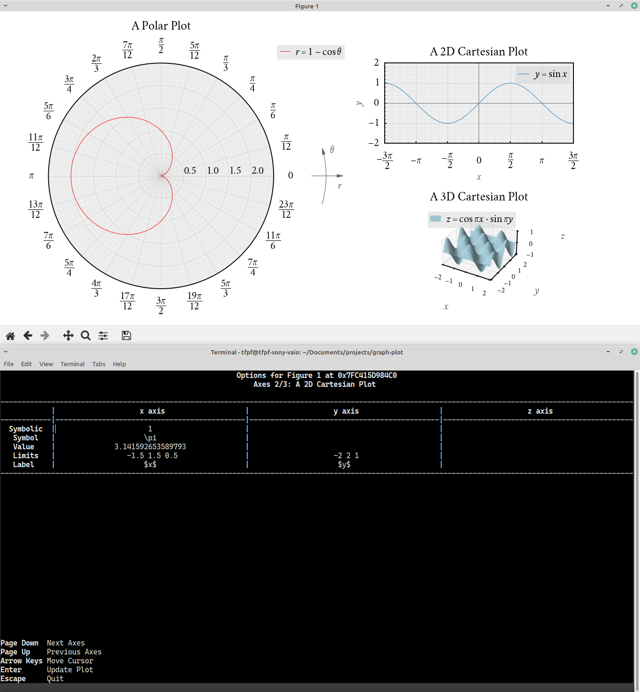

# Introduction
Customplot is a  wrapper around Matplotlib. It can be used to plot beautiful,
publication-quality graphs, which can optionally be controlled interactively.



I mainly wrote this to plot graphs of functions, but it can be used for almost
anything, really. (Take a gander at the [gallery](#gallery).)

# Requirements
| Name       | Version  |
| :--------: | :------: |
| Python     | 3.8      |
| Matplotlib | 3.3.4    |
| NumPy      | 1.17     |
| Tkinter    | 8.6      |

These requirements are not strict. Slightly older versions should also be okay.

# Usage
Call `limit` and `polish` on your Matplotlib axes instance before and after
plotting, respectively. Check the file `examples.py` for details. You can run
it using the command
```console
$ python3 examples.py
```
to see how things work.

A good way to start plotting your own graphs might be to copy parts of the code
in `examples.py` to another file, make modifications to that file, and run it.

# Notes

## General
Customplot cannot replace Matplotlib or Pyplot. It just does a few things which
make the plot look appealing. For sufficiently complicated plots, you may have
to use functions of Matplotlib or Pyplot directly.

Only `rectilinear`, `polar` and `3d` projections of Matplotlib axes are
supported. Other projections can also be used, but their beautification may not
happen automatically.

## Fonts
Using a good font can significantly improve the appearance of your plot. (Check
out the [gallery](#gallery). The font used in those plots is
[Cochineal](https://ctan.org/pkg/cochineal).)

In case you want nothing to do with fonts, you can ignore this section
entirely. Matplotlib will warn you that Cochineal is not installed (if it
isn't), and fall back to the default font. (Functionality remains unaffected.)

### Using a Built-in Font
You have a choice of fonts available out of the box. My suggestion is to use a
STIX font. To do so, modify the file `dandy.mplstyle` like this. (Only the
relevant lines are shown.)
```python
...
font.family: STIXGeneral
...
mathtext.fontset: stix
...
```

I do not recommend using the built-in Computer Modern font, because it cannot
render minus signs in normal text.

### Using a Custom Font
Let's say you want to use Libre Baskerville.
* Download the font files for Libre Baskerville. (It is a Google font. So, it
will probably be freely available as a package containing four or more files
with the extension `.ttf`, or perhaps `.otf`).
* Create a new directory `~/.fonts/LibreBaskerville` and put the
above-mentioned font files in that directory.
* Find out where Matplotlib stores its cache.
```console
$ python3
>>> import matplotlib
>>> print(matplotlib.get_cachedir())
```
* Delete all font-related cache files in that location.
* Open the file `dandy.mplstyle` and search for `Cochineal`. Replace it,
wherever it appears, with `Libre Baskerville`. In other words, the contents of
`dandy.mplstyle` should be something like this. (Only the relevant lines are
shown.)
```python
...
font.family: Libre Baskerville
...
mathtext.bf:  Libre Baskerville:bold
mathtext.cal: Libre Baskerville:bold:italic
mathtext.it:  Libre Baskerville:italic
mathtext.rm:  Libre Baskerville
...
```

If you feel confident, you can experiment with different fonts (i.e. a
monospace font for `mathtext.tt`, a calligraphy font for `mathtext.cal` and a
sans-serif font for `mathtext.sf`).

## Subplots
Sometimes, subplots (multiple plots in a single figure) don't look pretty
because elements from adjacent plots overlap with each other. To get around
this problem, you can interactively adjust the spacing by using the 'Configure
subplots' option in the navigation toolbar of the figure.

After doing this, maximise, un-maximise and again maximise the figure window.
As a result, anything that needs to be redrawn will be redrawn.

## DPI Settings
If the plot doesn't look quite right, try playing around with the DPI parameter
before adjusting anything else. In the file `dandy.mplstyle`, search for
`figure.dpi` and change the value next to it.

In my experience, a value of 120 produces pretty graphs on a 1080p screen,
while a 768p screen requires a value of 85 or so. On a 720p screen, 80 should
work well.

## Essential and Jump Discontinuities
There are two types of discontinuities most graph plotters struggle with:
* essential discontinuities (like those in the graph of _y_ = tan _x_); and
* jump discontinuities (like those in the graph of _y_ = sgn _x_).

A vertical line is automatically drawn at each point of discontinuity. This is
simply a result of the plotting algorithm used by graph plotters. If this
happens in your plot, try using the `sanitise` function with a suitable value
of `maximum_diff`. (A demonstration can be found in `examples.py`.)

# Gallery
  
  
  
  
  
  
  
  
  


